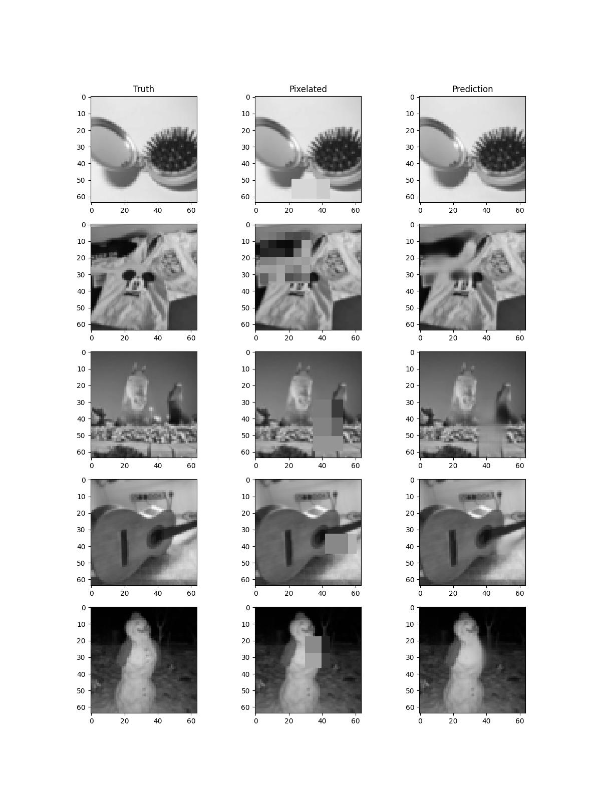
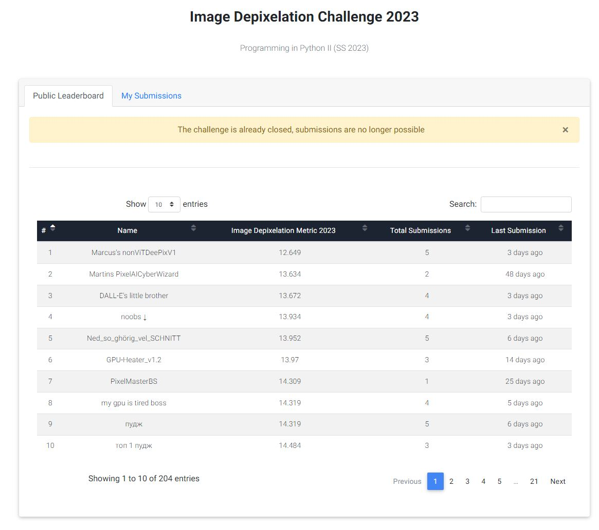

# Depixelation
With this project I was able to successfully implement and train an image "depixelation" model, which claimed rank 1 
out of 204 students at the JKU Linz Image Depixelation Challenge 2023 leaderboard.

Since the test set, on which the evaluation of our models took place, was based on 64x64 grayscale image
dataset with certain known parts pixelated, the following work was tailored towards this special case.

Later I also discuss possible ways of extending this work for the more general case of the model
also having to infer what part of the image is pixelized.

During training pixelation was done randomly on each image and both the pixelated image, as well as a
mask which signalled where on the image the pixelation took place, was fed into an according architecture.

This means the model did NOT have to learn to infer where pixelation took place and could focus solely on
the task of incribing appropiate pixels in the respective fields.

Notice how the model successfully continues shapes surrounding the pixelated parts of the image.
If the neighboring section has a lot of detail, the model is not able to continue it well, this however
is more a result of the loss being computed by the MSE to the original input than anything else, because
rough pixelation inside an area with high detail means the model is safer to predict some sort of middleground,
than actually trying to inpaint something that could be possible.

This means the model tries to continue possible shapes inside the pixelated are based on pixelation, it is
not a generative inpaint model.

**However, this could easily be changed when further combining it
with a GAN in sequence. The adversery of the GAN should then identify blurred regions, while the generating agent
should further refine the given areas.** This approach might ensure _accurate_ inpainting of the GAN, opposed to
directly employing a GAN.

So when combined with a model with the sole purpose of finding the pixelated area, which should be relatively easy to train,
one could create a full **3 layered sequential model**. This **3-layer model should then be able to accuratly inpaint into
pixelated areas solely based on an pixelated image.**

Of course this could again be **generalized to multiple pixelated areas inside one image**. Such a transition would mostly entail
increasing the complexity of the pixelated area finder and some finetuning to the two following models.

The final model can be found under "models_serious/Deepixv1(5,5,6,6,7,7,8)(3,5).pt".

## Project Structure
### Handling Data
The files "datasets.py" and "data_utils.py" feature a variety of Code needed for the RandomImagePixelation
dataset.

### General Utility
Whereas "utils.py" provides general utility for the project (plotting, kernel size interpolation,
serializing test predictions for submission, etc.).

### Architectures
Of course "architectures.py" features all the different architectures I tried during the many tests on
smaller datasets and "main.py" is mainly used for initiating the training loop and directly getting a
qualitative look at the predictions of the model on a small number of hand-picked samples from the
originally provided dataset.

Also, this file can be used as a script in conjunction with torchinfo (https://github.com/TylerYep/torchinfo)
to get a good overview of a certain instanced architecture and also estimate training loads based on batch
size.

### Folder-structure
Models which served more a purpose of trying out different hyperparameters are stored under "models/", whereas
the seriously trained model on a much larger dataset (original data + STL10 unlabeled images - 
https://cs.stanford.edu/~acoates/stl10/) where stored under "models_serious/".

Under "losses/" the according monitored training and evaluation loss can be seen.

## Architecture
The architecture design came together through a mixture of heuristics, experimentation and standard design patterns.

### DeePixV1
The DeePix architecture consists mostly of foundational building blocks, further called BasicBlocks or rather BasicAddBlocks,
which are descendants of this class and only have slight differences.

#### BasicBlock

Describe architecture in detail here...

## Thought and Outline

Since the test set used for evaluation provided us with the original masks for where the image was pixelated and where not, I figured why not exploit that directly.

I restricted the pictures to 64x64, as mentioned in the description and concatenated the mask and the original along the channel dimension. I essentially passed it through a lot of CNN layers that got increasingly more kernels (here the heuristic is extracting more and more finer and more complex features) and I also increased the kernel size. Normally its not that common anymore to increase kernel size as one goes deeper, most models keep it at 3x3 or something and just increase the number of kernels, but in this case, it seems to work fine.

The last layer’s output was also 64x64 but only one channel, but for the final prediction I just picked the original input pixels for every index where the Boolean mask (known_array) said so, and only integrated the part which was previously unknown.

I also included some residual connections for stability reasons (only additive residuals and no concatenating ones). This way the model could solely focus on the inlining part and did not have to learn what pixels to leave as is. This approach did yield a 13.2 score or something with around 1.8mil parameters.

For the final model I just scaled it up, here going deep seemed to be better than going wide and scaled it up to around 2.5mil parameters for the 12.6 score and 1st place (although I had a power outage quitting training at around epoch 40).

If you wanted to include inferring what area is pixelized into the model, I think training a separate model whose only job is to identify the pixelized coordinates would be best, and then just putting them in a sequence.

I did consider using a visual transformer (ViT), because as we know from ChatGPT and the likes, transformers are really good at working with contexts, but I only started the project 5 days ago and did not have the time. I’m also still not well versed with some of the SOTA methods as I just transferred from my physics studies. Maybe reducing the resolution when going wider could have made the model a lot more parameter efficient.

I also added the STL10 unlabeled images dataset to the one given to us, and I did not use any augmentation, as the random pixelation already is kind of like augmentation as long as the base dataset is diverse and big enough, so I figured I should just increase it.

Also, I did use a sigmoid activation in the end, but I think there are some valid arguments for ReLU or GELU or some selfmade one which caps values at 1 (did not test it though).

I did not use any prebuilt architectures or weights (but got inspired by the ResNET architecture) and trained on a GTX 1080ti.

## Number 1 on Image Depixelation Challenge Leaderboard at JKU Linz

